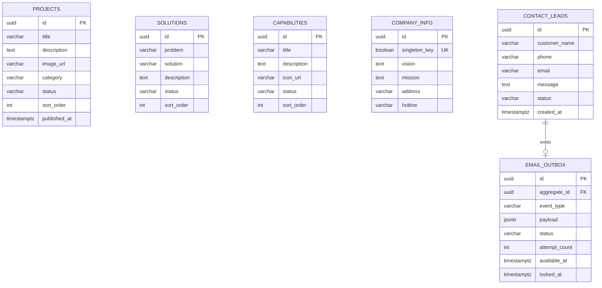

# QTS Backend

Node.js, Express, TypeScript, and PostgreSQL backend for both the QTS public website and the authenticated internal portal. It combines public CMS reads and contact intake with JWT authentication, dynamic RBAC, personnel and role administration, lead assignment, contract and task workflows, protected file downloads, and DOCX contract generation.

## Architecture

```text
Public website + internal portal
                |
                v
Express API (validation, CORS, rate limiting, JWT/RBAC, security headers)
                |
                +----> PostgreSQL: content, leads, users/RBAC, contracts, tasks
                |
                +----> local/private storage: templates and ZIP/RAR downloads
                |
                +----> transaction: contact_leads + email_outbox
                                                      |
                                                      v
                                         contact email worker -> SMTP
```

SMTP is not called during `POST /api/contact`. Once the database transaction commits, the API returns `201`; a separate worker claims the outbox event and retries delivery. This keeps an SMTP outage from losing a lead or causing a false failed submission.

## Directory Structure

```text
backend/
  docs/
    decisions/                 Architecture decisions
    openapi.yaml               REST contract
    SPEC.md                    Scope and acceptance criteria
  migrations/                  Reversible PostgreSQL SQL migrations
  scripts/                     Migration and seed runners
  src/
    common/                    API errors, pagination, request context
    config/                    Validated environment configuration
    database/                  PostgreSQL pool and shared types
    middleware/                JSON error handling
    modules/
      access-management/       Users, roles, and permissions
      audit/                   Append-only security event projection
      auth/                    JWT login and credential verification
      cms/                     Admin CMS mutations
      contact/                 Public contact intake
      contracts/               Contract CRUD and DOCX generation
      files/                   Authorized archive streaming and storage adapter
      internal-portal/         Authenticated route composition and RBAC guards
      leads/                   Employee lead lists and Admin assignment
      outbox/                  Email template, outbox repository, worker
      projects/                Public project reads
      public-content/          Capabilities, solutions, metrics, company info
      tasks/                   Scoped task management and assignment
    observability/             Structured Pino logger
    app.ts                     Injectable Express application
    server.ts                  API process lifecycle
    worker.ts                  Email worker process lifecycle
  tests/                       Unit and HTTP contract tests
  scripts/                     Trusted bootstrap, template, and archive CLIs
```

## Database Schema



Internal portal entities are added by migration `002_internal_portal`: `users`,
`roles`, `permissions`, the two RBAC join tables, contracts/templates, tasks,
stored files, CMS metrics, sessions, and append-only audit logs. The normalized
RBAC design and DOCX generation pipeline are documented in
[docs/SPEC.md](docs/SPEC.md).

Status values:

- Public content: `DRAFT`, `PUBLISHED`, `ARCHIVED`.
- Contact leads: `NEW`, `IN_PROGRESS`, `CONTACTED`, `CLOSED`, `SPAM`.
- Email outbox: `PENDING`, `PROCESSING`, `SENT`, `DEAD`.

The outbox JSON payload contains only the lead ID. It deliberately does not duplicate customer PII.

## REST API

All internal routes require a Bearer access token. Each route additionally checks the permission shown below; permissions are resolved dynamically from the user's current roles on every request.

### Public routes

| Method | Endpoint | Notes |
| --- | --- | --- |
| `GET` | `/api/capabilities?page=1&pageSize=20` | Published capabilities |
| `GET` | `/api/projects?page=1&pageSize=12&category=Cybersecurity` | Published projects |
| `GET` | `/api/projects/:id` | Published project or `404` |
| `GET` | `/api/solutions?page=1&pageSize=20` | Published problem/solution entries |
| `GET` | `/api/metrics?page=1&pageSize=20` | Published company metrics |
| `GET` | `/api/company-info` | About, vision, mission, address, hotline |
| `POST` | `/api/contact` | Creates a lead and notification event |

### Authentication and employee routes

| Method | Endpoint | Permission / notes |
| --- | --- | --- |
| `POST` | `/api/auth/login` | Public login endpoint; returns a short-lived JWT |
| `GET` | `/api/leads/assigned` | `read:lead`; only the authenticated employee's leads |
| `GET` | `/api/contracts` | `read:contract`; owner-scoped unless `manage:contract` |
| `POST` | `/api/contracts` | `write:contract`; employee ownership is enforced |
| `GET/PATCH/DELETE` | `/api/contracts/:id` | `read:contract` / `write:contract`; owner-scoped unless `manage:contract` |
| `POST` | `/api/contracts/generate` | `generate:contract`; worker-rendered DOCX with count/byte admission and timeout |
| `GET` | `/api/files/archives/:id/download` | `read:file`; resource ownership is checked before streaming ZIP/RAR |
| `GET/POST` | `/api/tasks` | `read:task` / `write:task` |
| `GET/PATCH/DELETE` | `/api/tasks/:id` | `read:task` / `write:task`; scoped to creator or assignee unless assigner |
| `PUT` | `/api/tasks/:id/status` | `write:task` |
| `PUT` | `/api/tasks/:id/assignee` | `assign:task` |

### Administration routes

| Method | Endpoint family | Permission / notes |
| --- | --- | --- |
| `PUT` | `/api/admin/leads/:id/assignee` | `assign:lead`; assign or unassign a public lead |
| CRUD | `/api/admin/users` | `manage:user`; create/update credentials or replace roles also requires `manage:role` |
| CRUD | `/api/admin/roles` | `manage:role`; includes `GET /:id` and `PUT /:id/permissions`; assigned roles cannot be self-modified |
| CRUD | `/api/admin/permissions` | `manage:role` |
| CRUD | `/api/admin/cms/projects` | `manage:web_public` |
| CRUD | `/api/admin/cms/solutions` | `manage:web_public` |
| CRUD | `/api/admin/cms/metrics` | `manage:web_public` |
| `GET/PATCH` | `/api/admin/cms/company-profile` | `manage:web_public` |
| `GET` | `/api/admin/audit-logs` | `read:audit`; paginated non-PII audit metadata |

See [docs/openapi.yaml](docs/openapi.yaml) for the detailed public API schemas. Internal route contracts are enforced by the TypeScript schemas and HTTP tests in this repository.

## Local Development

Prerequisites: Node.js 22+ and PostgreSQL 15+ (or Docker).

```powershell
Copy-Item .env.example .env
npm install
docker compose up -d postgres
npm run db:migrate
npm run db:seed
npm run dev
```

Before the first portal login, provide the four `BOOTSTRAP_ADMIN_*` values in `.env`, then provision the initial administrator once:

```powershell
npm run db:bootstrap-admin
```

The command refuses to run after any account has been assigned the system
`ADMIN` role. Remove the bootstrap values immediately after it succeeds; no
default password is provided or logged.

An administrator can provision an approved DOCX template from an explicit,
trusted local path. The actor must be `ACTIVE` and currently hold
`manage:contract`:

```powershell
npm run contract-template:provision -- `
  --source "C:\secure-input\qts-contract.docx" `
  --name "QTS Standard Contract" `
  --description "Approved standard customer contract" `
  --allowed-fields "contractNumber,customerName,effectiveDate" `
  --output-filename "qts-contract.docx" `
  --actor-id "00000000-0000-4000-8000-000000000000"
```

The matching `CONTRACT_TEMPLATE_*` values in `.env.example` can be used instead;
CLI flags take precedence. The command rejects symlinks, malformed or oversized
DOCX archives, unsafe metadata, and destination collisions. It creates a
private `0600` file below
`INTERNAL_FILE_STORAGE_ROOT/contract-templates`, then records the template and
an audit event in a database transaction. Neither the source path nor document
contents are logged. The returned UUID is the `templateId` accepted by
`POST /api/contracts/generate`.

Administrators ingest ZIP/RAR downloads through a separate trusted CLI. There
is intentionally no public upload endpoint. Configure the mandatory malware
scanner, then provide an absolute source path, the client-visible filename,
the acting administrator, and exactly one owner context:

```powershell
npm run archive:ingest -- `
  --source "D:\secure-input\customer-record.zip" `
  --original-filename "customer-record.zip" `
  --actor-id "00000000-0000-4000-8000-000000000000" `
  --contract-id "00000000-0000-4000-8000-000000000000"
```

Use `--owner-id`, `--contract-id`, or `--task-id`, exactly once. The actor must
be `ACTIVE` and currently hold `manage:file`; the referenced context must
exist. CLI values override only the matching `ARCHIVE_INGEST_*` environment
values; scanner settings are deployment-controlled and have no CLI override.

`ARCHIVE_SCANNER_EXECUTABLE` is an absolute path to a trusted executable.
`ARCHIVE_SCANNER_ARGS_JSON` is a JSON string array of fixed arguments; the CLI
appends the copied archive path as the final argument and starts the process
without a shell. The scanner contract is: exit `0` = clean, exit `1` =
infected, all other exits/errors/timeouts = scan failure. Only a clean file is
inserted. Infected and failed scans remove the copied file and write no
`stored_files` row.

The CLI rejects symlinks, non-regular files, mismatched extensions/magic bytes,
source changes during copying, destination collisions, oversized input, and
scanner mutation. Exact bytes are copied to private
`stored-archives/<uuid>.zip|rar` storage with mode `0600`; SHA-256 and size are
recorded with `scan_status=CLEAN`. Metadata and the
`FILE.ARCHIVE_INGESTED` audit event commit in one serializable transaction.

`INTERNAL_FILE_STORAGE_ROOT` must already exist as a real, writable private
directory, normally the persistent volume mounted for the API. The CLI does not
follow a symlink or create missing parent directories.

Archive verification creates a private temporary snapshot before response
headers are sent. Each API process admits at most
`MAX_ARCHIVE_INFLIGHT_DOWNLOADS` concurrent downloads and
`MAX_ARCHIVE_INFLIGHT_BYTES` total metadata bytes across preflight and
streaming. The byte budget must be at least `MAX_ARCHIVE_BYTES`. Capacity
exhaustion returns `503 ARCHIVE_DOWNLOAD_BUSY` with the configured
`ARCHIVE_DOWNLOAD_RETRY_AFTER_SECONDS` in `Retry-After`; a disconnected client
aborts hashing/copying and releases both the snapshot and admission lease.

If the database connection is lost while `COMMIT` is in progress, the command
retains the final file because PostgreSQL may already have committed its row.
For templates, reconcile `contract_templates.storage_key` against
`contract-templates/`; for archive ingestion, reconcile
`stored_files.storage_key` against `stored-archives/`. Pre-commit errors roll
back and remove only the inode created by that command.

The API is then available at `http://localhost:4000`. The example `DATABASE_URL` targets the PostgreSQL container published by Compose at `localhost:5434`. Start the mail worker in a second terminal after configuring SMTP:

```powershell
npm run worker
```

Useful health endpoints:

- `GET /health/live`: process liveness.
- `GET /health/ready`: PostgreSQL readiness.

## Quality Gates

```powershell
npm run lint
npm run typecheck
npm test
npm run build
npm audit --audit-level=high
```

Tests run in-process and do not send email or require a database. Migration and repository smoke checks should additionally run against PostgreSQL before deployment.

## Production Notes

- Run API and worker as separate processes from the same image.
- Apply `npm run db:migrate:prod` before switching traffic.
- Mount persistent private storage at `/app/storage` (or set `INTERNAL_FILE_STORAGE_ROOT` to another writable mounted path). The image creates `/app/storage` for the non-root `node` user, but an external volume is required to preserve templates and stored archives across container replacement.
- Install the approved archive scanner in the CLI runtime (or mount its absolute executable path), and operationally pin its version/signatures and exit-code contract.
- Set `DATABASE_SSL=true` only with a PostgreSQL endpoint whose certificate chains to the runtime trust store.
- Set `TRUST_PROXY_HOPS` to the exact number of trusted reverse proxies; leave it `0` when Express is directly exposed.
- Use a distributed rate-limit store or an edge/WAF limiter when running multiple API replicas. The built-in limiter is per process.
- Archive and DOCX generation in-flight limits are per process. Enforce aggregate concurrency and byte budgets at the gateway/orchestrator when running multiple replicas.
- DOCX ZIP inspection and rendering run in memory-limited worker threads with a hard timeout. Capacity exhaustion returns `503 GENERATION_BUSY` and `Retry-After` rather than queueing unbounded work on the API event loop.
- Keep `.env` out of Git and supply production secrets through the deployment secret manager.
- Login, authenticated mutations, DOCX generation, and archive downloads synchronously persist a non-PII `ATTEMPT` audit row before business handling. If audit storage is unavailable, the request fails closed with `503 AUDIT_UNAVAILABLE`; completion outcomes are recorded separately after the response.
- Alert on oldest pending outbox age and `DEAD` count. Delivery is at-least-once, so the deterministic `Message-ID` is retained on retry.
